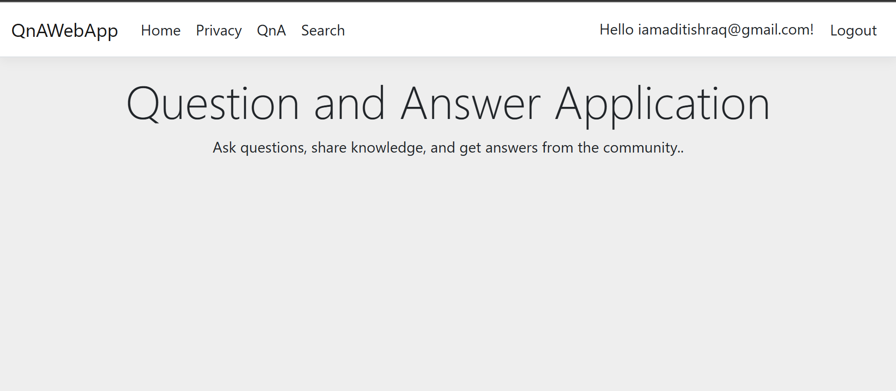
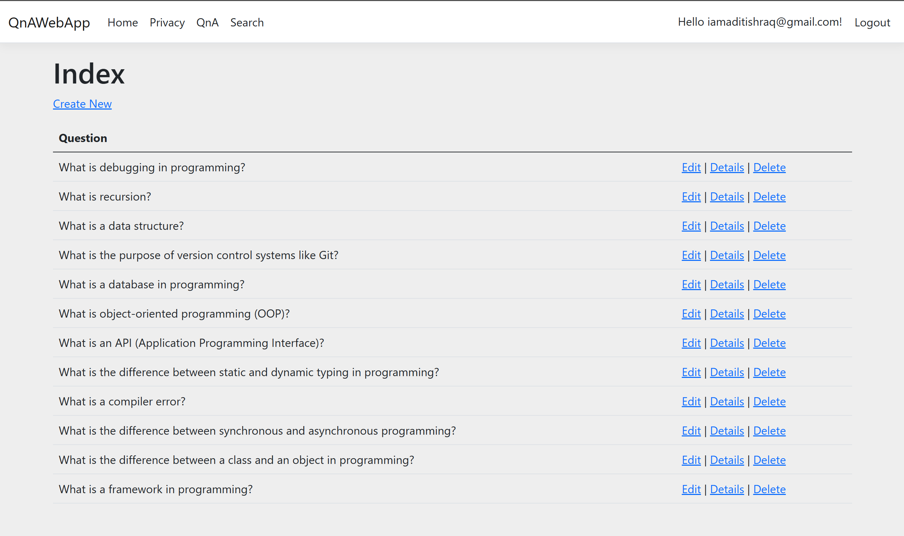
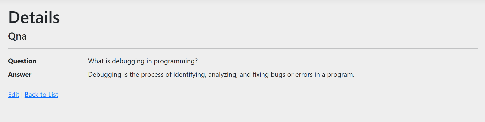
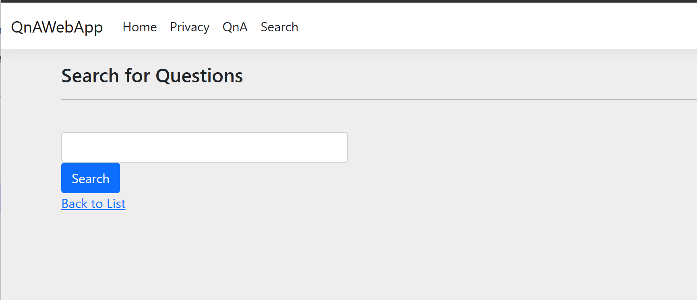
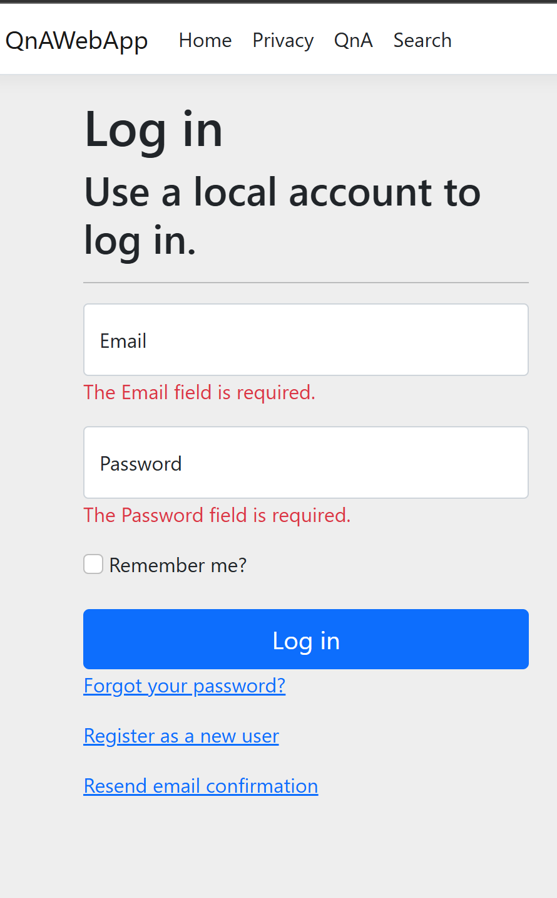
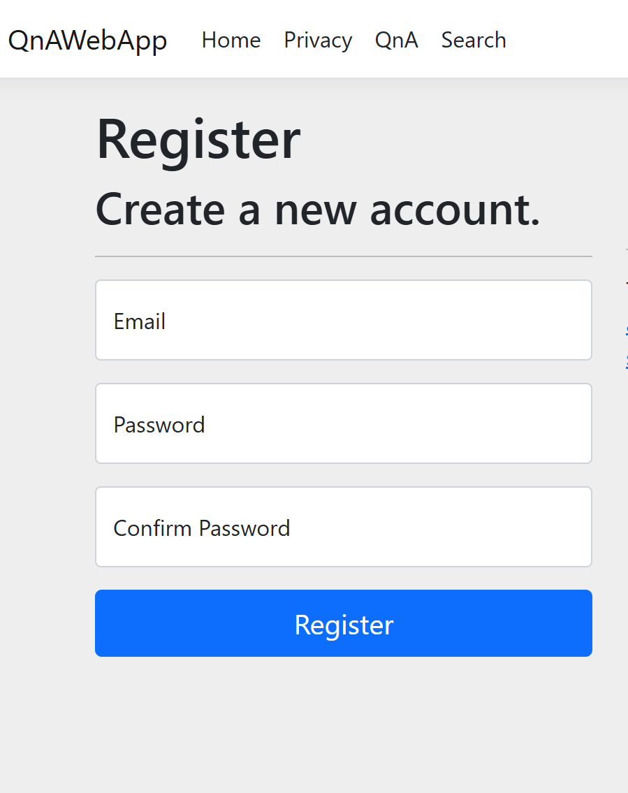
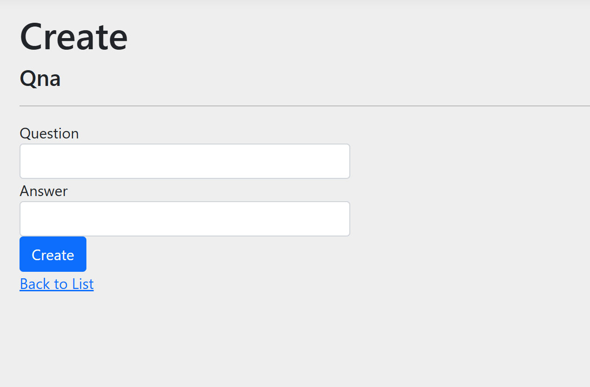

# QnA App - ASP.NET Core MVC

This is a simple Question Answer App built using ASP.NET Core MVC. The application allows users to create, read, update, and delete (CRUD). It also includes features like user authentication, search functionality, and basic styling using CSS.

## Features

- **CRUD Operations**: Create, Read, Update, and Delete Question and Answers.
- **User Authentication**: Users must log in to create, edit, or delete jokes.
- **Search Functionality**: Search for questions based on keywords.
- **Responsive Design**: Built using Bootstrap for a responsive and clean UI.
- **Custom Styling**: Custom CSS to enhance the look and feel of the app.

## Technologies Used

- **ASP.NET Core**: A cross-platform, high-performance framework for building modern, cloud-based, and internet-connected applications.
- **Entity Framework Core**: An ORM (Object-Relational Mapper) used to interact with the database.
- **Bootstrap**: A front-end framework for developing responsive and mobile-first websites.
- **Razor Pages**: A page-based programming model that makes building web UI easier and more productive.
- **SQL Server**: A relational database management system used to store question, answers and user data.

## Getting Started

### Prerequisites

- [.NET Core SDK](https://dotnet.microsoft.com/download)
- [Visual Studio](https://visualstudio.microsoft.com/) (or any other code editor like Visual Studio Code)
- [SQL Server](https://www.microsoft.com/en-us/sql-server/sql-server-downloads)

### Installation

1. **Clone the repository**:
   ```bash
   https://github.com/aditishraq/QnA-WebApp.git
   cd QnA-WebApp
   ```

2. **Restore dependencies**:
   ```bash
   dotnet restore
   ```

3. **Set up the database**:
   - Update the `appsettings.json` file with your SQL Server connection string.
   - Run the following commands to apply migrations and create the database:
     ```bash
     dotnet ef database update
     ```

4. **Run the application**:
   ```bash
   dotnet run
   ```

5. **Access the application**:
   - Open your browser and navigate to `https://localhost:5001` (or the port specified in your launch settings).

## Usage

- **Home Page**: Displays a list of jokes.
- **Create Question and Answer**: Log in to create a Question and Answer.
- **Edit/Delete Question and Answer**: Log in to edit or delete existing Question and Answer.
- **Search**: Use the search bar to find Questions and Answers by keyword.
- **User Authentication**: Register and log in to access restricted features.


## Screenshots










## Acknowledgments

- Microsoft Docs for ASP.NET Core documentation.
- Bootstrap for the front-end framework.


